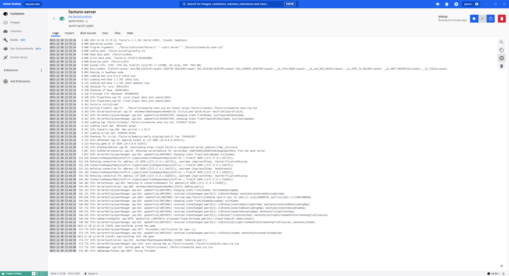

This project is a Docker container setup for hosting a Factorio server. It demonstrates the use of Docker for containerizing applications, in this case, a popular game server. This setup allows for easy deployment, scaling, and management of the game server environment.

Features:
- **Easy Setup**: Quick and simple deployment of a Factorio game server.
- **Portability**: Run the server on any system with Docker, regardless of the underlying OS.
- **Isolation**: The game server runs in an isolated environment, minimizing conflicts with other system processes.

 

### Running the Server
1. **Pull the Image**: `docker pull gtownley95/my-factorio-server`
2. **Start the Server**: `docker run -it -p 34197:34197/udp -v /your/save/path:/factorio/saves --name factorio-server gtownley95/my-factorio-server`
3. **Connect to the Server**: Use the Factorio client to connect to `localhost:34197`.

  

*Replace `/your/save/path` with the path to your Factorio saves on your host machine.*
 

The Docker image is also available on Docker Hub: [gtownley95/my-factorio-server](https://hub.docker.com/r/gtownley95/my-factorio-server)

 

*Server logs showing a successful connection and disconnection of a client.*
